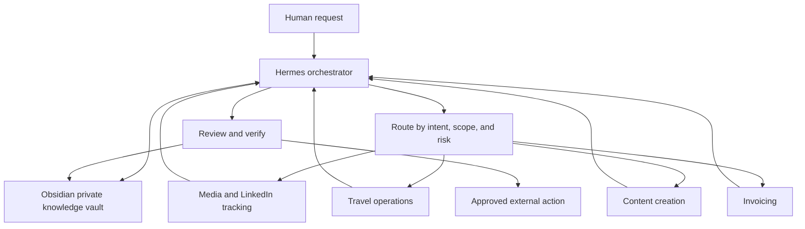

# Architecture

## Public core and private overlay

The public core contains generic procedures and templates. The private overlay contains the identity, data, integrations, and deployment decisions of one person.

```text
public-core/
├── docs/
├── templates/
├── skills/
└── workflows/

private-overlay/
├── identity/
├── memory/
├── writing-samples/
├── integrations/
└── local-config/
```

The safe flow is from public core into a private installation. Do not automatically publish from the private overlay back to the public repository.

## Obsidian as the knowledge hub

In this architecture, **Obsidian is the private, persistent knowledge layer**: a human-readable vault that can hold curated memory, project context, sources, decisions, and reusable procedures. It is the knowledge source Hermes consults across conversations—not the orchestrator, model, or place to dump every raw chat.

Hermes retrieves only the notes needed for a task, coordinates specialist agents, and can preserve verified outcomes as durable notes with provenance. Specialists should receive only the context they need; their results return through the orchestration and review flow. The live vault, personal notes, and deployment details stay private. The public repository contains only generic templates and fictional examples.

The vault structure is user-specific. Treat `YOUR_VAULT_PATH` as private configuration and do not publish the real path, vault contents, or linked attachments.

## Hermes as orchestrator

Hermes sits above a set of specialist agents. It owns the conversation and coordination: understand the request, select the right specialist, pass the minimum necessary context, combine the result, enforce approval boundaries, and verify completion. A specialist should not need broad access to every memory, channel, or tool just because Hermes has it.



Examples of bounded specialist responsibilities:

- **Media and LinkedIn:** monitor relevant sources, verify an appearance, and record its date, source, and link.
- **Travel:** maintain only upcoming or otherwise relevant trips, and mark completed travel as historical.
- **Content:** research and draft/adapt content; do not publish without the required approval.
- **Invoicing:** gather the billing inputs and prepare documents in a private workspace; treat amounts and generated files as sensitive.

These roles may be implemented as separate agent profiles or as tightly scoped agent workflows, depending on the platform. Keep their responsibilities, data access, and allowed tools explicit.

## Recommended components

- **Orchestration layer:** Hermes coordinates requests, specialist selection, context handoff, and result synthesis.
- **Specialist layer:** focused agents or workflows for repeatable domains such as media tracking, travel, content, and invoicing.
- **Conversation layer:** the assistant and its channel adapters.
- **Memory layer:** Obsidian or another human-readable knowledge base as the canonical private vault for curated context and durable records.
- **Skill layer:** reusable procedures loaded when relevant.
- **Routing layer:** deterministic rules plus model selection for complex cases.
- **Tool layer:** filesystem, web, code, browser, messaging, and scheduling capabilities.
- **Review layer:** approval gates for publishing, messaging, payments, and destructive changes.
- **Verification layer:** read-back checks, tests, and evidence records.

## Integration rule

Integrations should be replaceable. Keep provider-specific credentials and adapters in the private overlay; keep the workflow contract provider-neutral.
