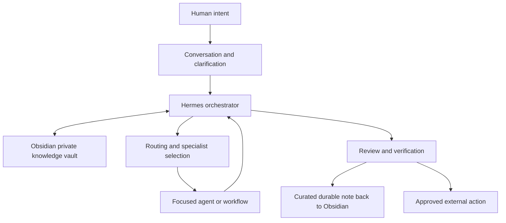
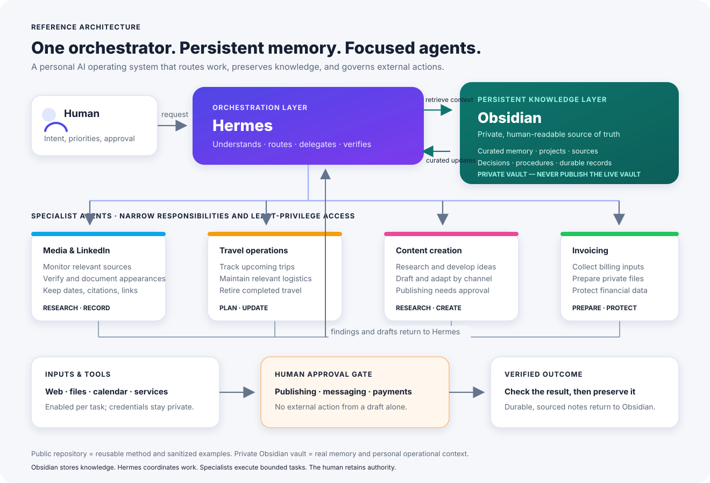
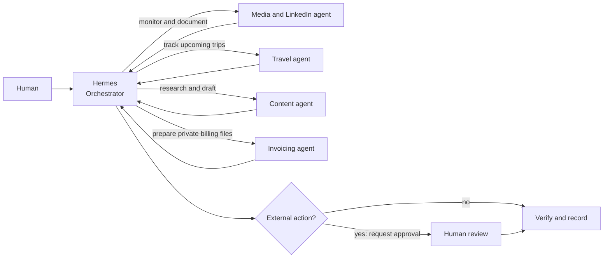
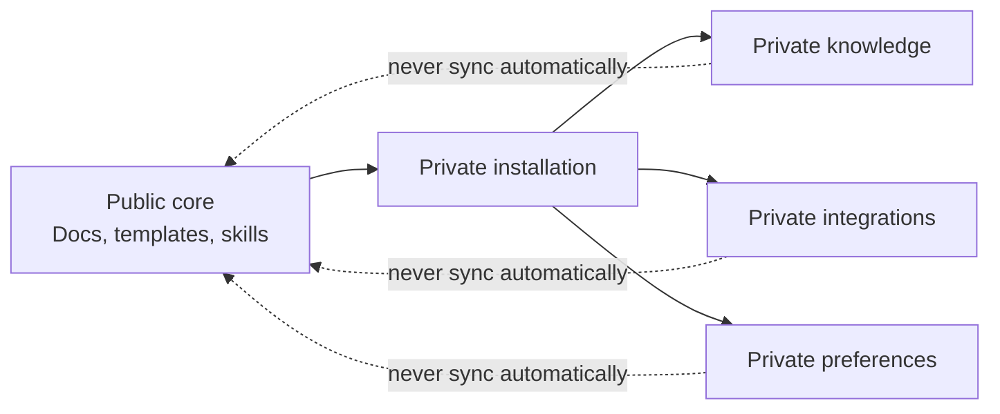
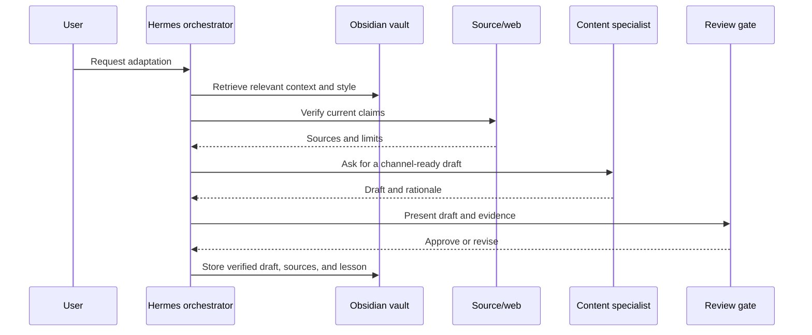
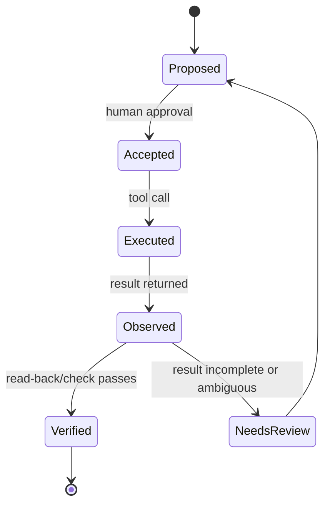
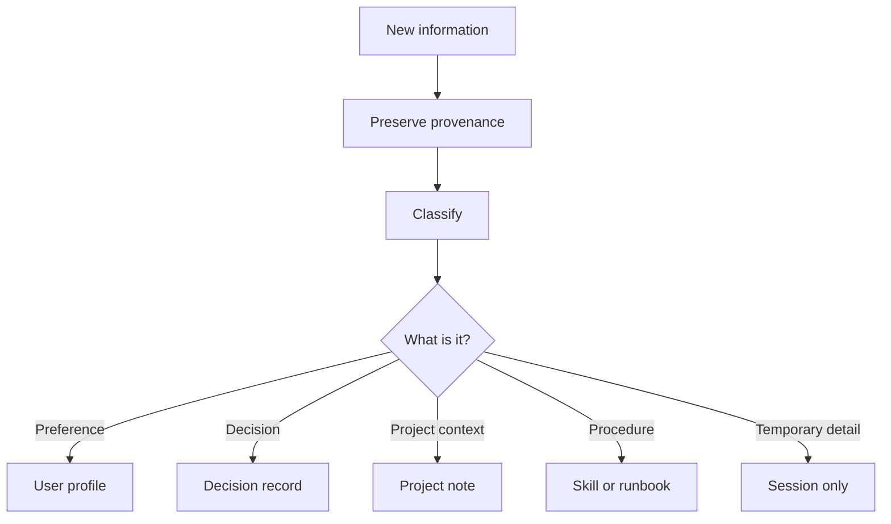

# How the system works

This guide explains the system without assuming prior knowledge of AI agents.

## 1. A personal AI system is a small operating system

A chatbot answers a message. A personal AI operating system maintains context, follows procedures, uses tools, and records what happened.

The important shift is from *prompt in, answer out* to *intent in, governed result out*.

The persistent knowledge layer in this architecture is **Obsidian**: a private, linked vault for curated memory, projects, sources, decisions, and procedures. Hermes retrieves relevant context from it and coordinates specialists; verified durable results can be recorded back into it. The vault is not a transcript dump and never flows into the public repository.

## 1a. Hermes coordinates specialist agents

Hermes is the orchestrator, not the only worker. It routes each request to a bounded specialist and remains responsible for coordinating, applying approval rules, and checking the outcome.

The specialists are examples of focused roles, not universal defaults. A deployment can implement them as separate agents or as narrowly scoped workflows. Either way, give each only the data and tools its task requires; drafts and preparations do not automatically authorize publishing, sending, or payment.

## 2. The public/private split

The public project contains reusable ideas. A real installation adds private identity, knowledge, accounts, and integrations.

This direction matters. The private layer may consume public improvements, but private data should never flow back into the public repository automatically.

## 3. What happens when a request arrives

Example: “Turn this article into a LinkedIn post.”

The assistant should not publish simply because it can generate a good draft.

## 4. Four states of truth

A tool call is not the same as a verified outcome.

Use these words in logs and reports. They prevent “the API returned 200” from being confused with “the intended change is visible in the target system.”

## 5. Why memory needs structure

Memory is more useful when it has an owner and status.

Do not turn the memory system into an unsearchable transcript archive.

## Rendering diagrams

GitHub renders Mermaid diagrams in Markdown. If a different renderer does not support Mermaid, the surrounding text should still explain the workflow in plain language.
